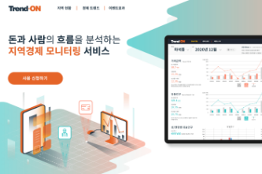
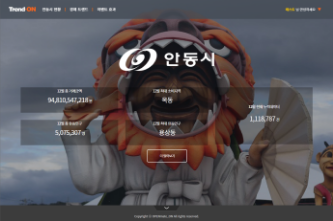
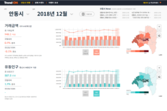
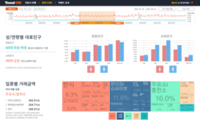
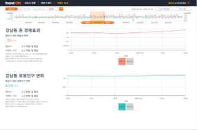
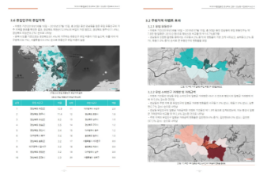

# <a href="https://trend-on.co.kr" target="_blank">Trend-ON</a>

## - 돈과 사람의 흐름을 분석하는 지역경제 모니터링서비스

## - 타겟팅: 공공기관

## - 카드데이터 기반

## - 부가서비스 지원: 리포트, 엑셀 다운로드

## - Setigo SSL 인증

<br/><br/>

|    유형    |                   스택                    | 참여(율) |
| :--------: | :---------------------------------------: | :------: |
| `Frontend` | HTML5, javascript(es3), css3(Media-Query) | O(100%)  |
| `Backend`  |             Spring Framework              |  O(50%)  |
| `Database` |                postgreSQL                 |  O(50%)  |
|  `Infra`   | Iaas(iwinV, Docker, Reverse proxy server) | O(100%)  |
| `Library`  | jQuery, leafletJS, d3, Jasper, Apache POI |          |

<br/><br/>








## Build Setup

```bash
# 전제조건: jdk + apache-tomcat or jetty

# IDE 연동
git clone

# project import

# maven update

# run server
```
